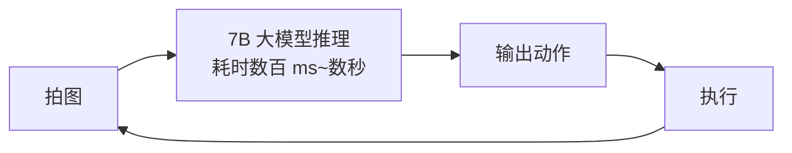
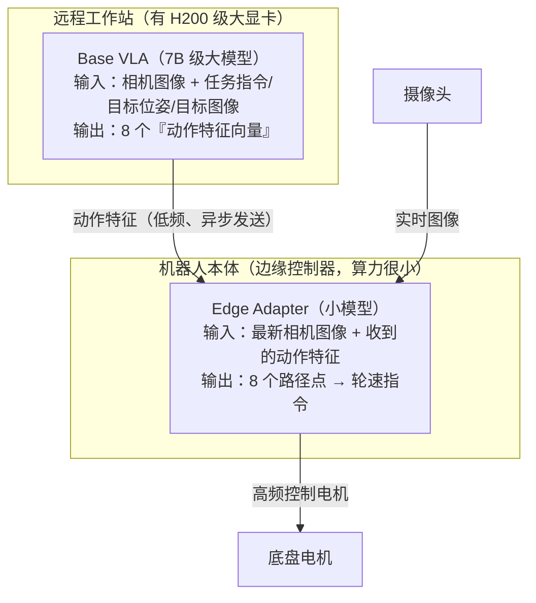

本文是「研究中心」系列的第一篇，面向**零基础读者**，完整拆解 UC Berkeley 团队的开源项目 **AsyncVLA**（An Asynchronous VLA for Fast and Robust Navigation on the Edge）。我们不假设你懂任何机器人学或深度学习知识，所有概念都会从头解释。文中所有技术细节均来自对官方开源代码（`NHirose/AsyncVLA`）的实际阅读，而非凭空推测。

<!-- more -->

## 1. 零基础前置知识包

在进入正题之前，先把这篇文章会用到的所有概念一次性讲清楚。如果你已经了解某些部分，可以跳过。

### 1.1 什么是具身智能（Embodied AI）

我们平时说的"AI"（比如 ChatGPT）活在文字世界里：输入文字，输出文字。**具身智能**指的是拥有**物理身体**的 AI——它有摄像头当眼睛、有轮子或机械臂当手脚，需要在真实的三维世界里感知环境、做出决策、完成移动或抓取等任务。

自动驾驶汽车、扫地机器人、波士顿动力的机器狗、仓库里的搬运机器人，都属于具身智能的范畴。

### 1.2 机器人的基本工作循环：感知 → 决策 → 执行

几乎所有机器人都运行着一个循环，叫做**感知-决策-执行循环（perception-decision-action loop）**：

1. **感知**：摄像头拍一张照片，传感器读一组数值（位置、朝向、速度等）；
2. **决策**：把照片和数值喂给某个"决策程序"，算出下一步该怎么做；
3. **执行**：把决策结果变成电机指令——"左轮转速 0.3m/s，右轮转速 0.25m/s"；
4. 回到第 1 步，周而复始。

这个循环每秒钟重复的次数叫做**控制频率**，单位是 Hz（赫兹，即"次/秒"）。控制频率越高，机器人对环境变化的反应越灵敏。人在走路时大脑的处理频率可以粗略理解为几十 Hz；而一个移动机器人在人群中穿行，通常也需要 10~30Hz 才显得"流畅"。

### 1.3 什么是 VLA（Vision-Language-Action 模型）

**VLA = Vision-Language-Action**，直译是"视觉-语言-动作"模型。它是最近两年机器人领域最火的方向，核心思想是：

> 把 GPT 那种"看图 + 识字 + 输出文字"的大模型，改造成"看图 + 识字 + **输出机器人动作**"。

一个典型的 VLA 模型内部有三块：

| 模块 | 作用 | 通俗比喻 |
|---|---|---|
| **视觉编码器**（Vision） | 把摄像头图像压缩成一串数字特征 | 视网膜 + 视觉神经 |
| **语言模型主干**（Language） | 理解任务指令、融合视觉信息、进行推理 | 大脑皮层 |
| **动作输出头**（Action） | 把内部推理结果转译成机器人能执行的动作 | 运动神经 |

VLA 的巨大优势在于**通用性**：传统机器人每换一个任务就要重新编程，而 VLA 像大语言模型一样"一个模型干所有活"——你用自然语言告诉它"走到蓝色的垃圾桶旁边"，它就能自己规划路线。

### 1.4 VLA 的致命弱点：又大又慢

能力强的 VLA 模型通常有 **7B（70 亿）级别的参数**——这和 Llama-2-7B 那一代语言模型是一个体量。这样的模型做一次"看图 → 想动作"的推理，在实验室的顶级显卡（如 H100）上也需要 **几百毫秒到几秒**，对应控制频率不到 1~5Hz。

这就是本文的**核心矛盾**：

> 大模型给了机器人"聪明的大脑"，但这个大脑的反应速度，远远跟不上机器人执行动作需要的节奏。更糟的是，机器人在户外跑动时，不可能背着一台 H100 服务器——机器人本体的计算设备（**边缘设备**，edge device）算力非常有限。

### 1.5 导航 vs 操作：机器人任务的两大类

| 任务类型 | 例子 | 动作形式 |
|---|---|---|
| **导航**（Navigation） | 移动机器人在园区/室内走到指定地点 | 底盘的线速度 + 转向角速度（二维平面运动） |
| **操作**（Manipulation） | 机械臂抓起杯子、叠衣服 | 每个关节的角度/力矩（多维空间运动） |

**AsyncVLA 解决的是导航问题**——让一个装有摄像头的轮式机器人，根据自然语言、目标图像或 GPS 坐标，在真实世界中又快又稳地到达目的地。

### 1.6 几个高频术语速查

| 术语 | 含义 | 通俗解释 |
|---|---|---|
| **Action chunk（动作块）** | 模型一次推理输出**连续多个时间步**的动作，而不是只输出一步 | 一次想好"未来 8 步怎么走"，而不是走一步想一步 |
| **Waypoint（路径点）** | 动作块里的每个动作，表示"相对当前位置前进多少" | 轨迹上一个个脚印 |
| **位姿（Pose）** | 位置 + 朝向，用 (x, y, θ) 表示 | 我在哪、脸朝哪 |
| **余弦/正弦编码角度** | 用 (cosθ, sinθ) 两个数代替角度 θ | 避免 359° 和 1° 在数值上"离得极远"的问题 |
| **LoRA** | 只训练插在原模型里的少量小矩阵，冻结原模型全部参数 | 不重写全书，只贴便签 |
| **ROS** | Robot Operating System，机器人操作系统，机器人界的"安卓" | 提供硬件通信、消息传递的标准框架 |
| **PD 控制器** | 一种经典的反馈控制算法，把"目标位置"换算成"轮子速度" | 把"想去哪"翻译成"轮子怎么转" |

## 2. AsyncVLA 是什么

**AsyncVLA**（arXiv: 2602.13476，MIT 协议开源）由 UC Berkeley 伯克利人工智能研究所（BAIR）的 Noriaki Hirose、Catherine Glossop、Sergey Levine 与普林斯顿大学的 Dhruv Shah 合作完成，作者同时来自丰田北美研究院（Toyota Motor North America）。这个团队是"视觉导航 + 机器人学习"方向的顶尖班底：Sergey Levine 是机器人深度学习的开创者之一，Dhruv Shah 是视觉导航模型 ViNT / GNM 系列的第一作者。

项目的目标一句话概括：

> **让 VLA 大模型驱动的导航机器人，能在算力弱小的机器人本体上做到"反应快、走得稳"。**

它的名字里有两个关键词：

- **Async（异步）**：大模型和小模型**不在同一个时钟上工作**——大模型慢悠悠地"深度思考"，小模型紧锣密鼓地"快速反应"，两者各干各的，互不阻塞；
- **Edge（边缘）**：专为机器人本体的低算力硬件设计，大模型可以放在远程工作站，机器人端只跑一个轻量模块。

## 3. 要解决的核心矛盾

先看传统做法为什么不行。如果直接在机器人上跑完整 VLA：



整条链路是**串行**的：机器人必须等大模型想完，才能动一步。后果有两个：

1. **反应慢**：控制频率被大模型推理速度锁死。机器人以 1m/s 走路时，如果 1 秒才决策一次，两次决策之间已经盲走 1 米——足以撞上突然出现的人或台阶；
2. **算不起**：机器人本体的边缘控制器（通常是一块嵌入式板子）根本装不下也跑不动 7B 模型。

AsyncVLA 的答案不是"把大模型压缩变小"，而是**架构层面的分工**——这和人类的工作方式惊人地相似：

> 人的大脑皮层负责"要去哪里"这种慢思考（路径级规划），而小脑和脊髓负责"迈腿时保持平衡"这种快反应（毫秒级控制）。没有人会等大脑想完全身再动。

## 4. 核心设计：Base VLA（大脑）+ Edge Adapter（小脑）

AsyncVLA 把整个系统拆成两部分，这也是代码仓库的名字由来——**Async + VLA**：



### 4.1 Base VLA：慢而聪明的大脑

Base VLA 基于 OpenVLA-OFT / OmniVLA 架构（代码沿用了 Prismatic 框架——OpenVLA 的官方训练代码库），内部是"视觉编码器 + Llama 系语言模型主干 + 动作回归头"的经典 VLA 组合。它的输入非常灵活，代码里定义了 **9 种模态组合**（`modality_id` 0~8），可以任意搭配：

- **卫星图**（satellite）：目标区域的高空俯视图；
- **位姿目标**（pose goal）：GPS 坐标 + 朝向；
- **图像目标**（image goal）："我要去照片里这个地方"；
- **自然语言**（language）："move toward blue trash bin"（朝蓝色垃圾桶走）。

推理时，用户给什么模态，就传对应的 `modality_id`，模型内部通过掩码机制决定"看哪些输入"——这是其前作 OmniVLA（全模态 VLA）留下的能力。

Base VLA 的输出**不是直接的动作**，而是 8 个**动作特征向量**（每个 1024 维，代码中由 `Proj_Actiontokens` 模块从语言模型隐状态压缩而来）。你可以把它理解为：

> 大脑输出的不是"迈左脚、迈右脚"这种具体指令，而是一份**抽象的行动意图书**——"接下来要往左前方绕过障碍走一段"。这份意图书需要有人翻译成具体的肌肉动作。

### 4.2 Edge Adapter：快而专注的小脑

翻译工作由 **Edge Adapter** 完成（代码中叫 `Edge_adapter`，变量名 affectionately 叫 `shead`，即 small head）。它非常小，结构是：

1. **两个 EfficientNet-B0 图像编码器**（一种轻量级卷积网络，手机上都能跑）：
   - 一个编码**当前帧**图像（3 通道）；
   - 一个编码**当前帧 + 上一帧堆叠**的图像（6 通道）——两帧叠在一起，网络就能看出"东西在往哪动"（光流的信息，但不需要显式计算光流）；
2. 一个**小型自注意力 Transformer 解码器**（4 层、4 头），把「8 个 VLA 动作特征 + 当前帧特征 + 帧对特征」共 10 个 token 放在一起做注意力融合；
3. 一个 4 层 MLP 输出 **8 个路径点增量**（每个 4 维：Δx、Δy、以及用 cos/sin 表示的朝向增量）；
4. `delta_to_pose` 把增量逐点累积成完整轨迹（纯张量运算，可微分），PD 控制器把第 4 个路径点换算成线速度和角速度指令，最后裁剪到安全范围（线速度 ≤0.5m/s、角速度 ≤1.0rad/s 等）发给电机。

**关键点：Edge Adapter 只接收 Base VLA 的特征作为"导航意图"，但用自己实时看到的最新图像来修正具体轨迹。** 这就是"快"的来源——它不依赖大模型的下一次输出。

### 4.3 异步机制：两层时钟各走各的

系统里有两个独立的时钟：

- **Base VLA 时钟**：每当机器人移动了一段距离（或每隔几秒），远程工作站用最新图像重新跑一次大模型，刷新一份"行动意图书"发给机器人；
- **Edge Adapter 时钟**：机器人本体以高控制频率（实际部署为 ROS1 控制循环）持续运行，每一步都拿着「最新收到的意图书 + 最新拍到的图像」重新预测一遍 8 个路径点。

两个时钟**不需要互相等待**：

- 大模型推理的那几百毫秒到几秒里，机器人照常走路（用的是上一份意图 + 新图像），不会"卡住"；
- 就算网络抖动、大模型暂时失联，Edge Adapter 仍能靠旧意图和新图像维持一段时间的合理行为——这就是论文标题里 **Robust（鲁棒）** 的含义。

官方示例代码 `inference/run_asyncvla.py` 里有一段非常直观的演示：固定同一份 VLA 特征，分别用「过去帧」和「当前帧」作为 Edge Adapter 的输入跑两次，画出两条轨迹——你会看到**仅凭新图像，轨迹就已经明显更新了**，证明小模型在实时"看着路走路"，而不是傻等大脑。

## 5. 代码库导览：每个目录在干什么

```
AsyncVLA/
├── prismatic/                  # 模型主体（源自 OpenVLA 的 Prismatic 框架）
│   ├── models/
│   │   ├── backbones/          # 视觉编码器（SigLIP/DINO 等）与语言主干（LLaMa2）
│   │   ├── action_heads.py     # 动作回归头（L1 回归）
│   │   ├── projectors.py       # 把目标位姿投影进语言空间的 ProprioProjector
│   │   ├── small_head.py       # ★ Edge Adapter + Proj_Actiontokens（本文核心创新所在）
│   │   └── vlas/ vlms/         # VLA / VLM 模型组装
│   ├── extern/hf/              # HuggingFace 格式的模型定义（推理时用 AutoModel 加载）
│   ├── vla/
│   │   ├── constants.py        # 关键常数：动作块长度 8、动作维度 4、位姿维度 4
│   │   ├── action_tokenizer.py # 把连续动作离散化成 token（供语言模型"说"出动作）
│   │   └── datasets/           # 各数据集的 Dataset 类（GNM/LeLaN/SACSoN/Frodobots…）
│   └── training/               # 训练工具（掩码构造等）
├── vla-scripts/
│   └── train_asyncvla.py       # ★ 训练主脚本（一 thousand 多行，含两阶段训练开关）
├── inference/
│   └── run_asyncvla.py         # ★ 推理示例（含轨迹可视化）
├── config_nav/
│   ├── dataset_config.yaml     # 数据集路径与 Edge Adapter 结构参数
│   └── mbra_config.yaml        # 前作 MBRA 的结构参数
├── experiments/                # 真机部署的辅助工具
└── SETUP.md                    # 环境安装说明
```

几个值得展开的点：

**`constants.py` 的数字从哪来？** `NUM_ACTIONS_CHUNK=8` 表示一次预测未来 8 个路径点；配置里 `metric_waypoint_spacing=0.1` 表示相邻路径点间隔 0.1 米——即模型每次规划**未来 0.8 米**的轨迹。`ACTION_DIM=4` 的四个分量是 (Δx, Δy, cosΔθ, sinΔθ)。

**动作既用 token 又用回归？** 这是 OpenVLA-OFT 的思路：训练时语言模型照样对动作 token 做下一词预测（保持语言主干的能力），但真正的动作值由并行的回归头从隐状态直接算出（更精确、支持连续控制）。AsyncVLA 在此之上多加了一层 `Proj_Actiontokens`——把"给回归头用的隐状态"再压缩成 Edge Adapter 能吃的 1024 维特征。

**推理示例怎么用？** 把自己的两张照片命名成 `past.png` / `cur.png`、一张目标图命名成 `goal.png` 放进 `inference/`，设置起点终点 GPS，运行后生成 `visualization_asyncvla.jpg`——左边是输入图像，右边是预测的二维轨迹图（蓝色为旧图像、红色为新图像的预测），并标注本次使用的模态（如 "pose and image"）。

## 6. 数据与训练

### 6.1 用了哪些数据集

| 数据集 | 内容 | 规模特点 |
|---|---|---|
| **GNM** | 户外/园区导航（recon、go_stanford、cory_hall、tartan_drive、seattle、scand 等子集） | ViNT 系列的标准数据 |
| **LeLaN** | 带自然语言指令的导航（作者前作提出） | 图像 + 语言 + 位姿 |
| **SACSoN (HuRoN)** | 人体环境中的人类居住空间导航 | 有人走动的真实场景 |
| **Frodobots** | 众包遥控小车在全球各地实跑的数据（通过 HuggingFace LeRobot 加载） | 真实世界长尾场景 |

训练时用**加权随机采样**把多个数据集混在一起（每个 batch 从不同数据集按权重抽取），这是机器人多数据集联合训练的标准做法。

### 6.2 两阶段训练

`train_asyncvla.py` 开头有两个总开关：

```python
TRAIN_BASE = False   # 训练 Base VLA（需要 H100/H200 级显卡）
TRAIN_HEAD = True    # 训练 Edge Adapter 和动作特征投影器
```

- **阶段一（TRAIN_BASE）**：用 LoRA（rank 128）微调 Base VLA 本体。官方配置用了 **5 张 H200（每张 140GB 显存）**，每个数据集 batch size 6，梯度累积 2 步——这告诉你复现完整训练的门槛很高；
- **阶段二（TRAIN_HEAD）**：冻结 Base VLA，只训练 Edge Adapter 和 `Proj_Actiontokens`。这一阶段轻量得多，也是普通研究者最值得复现的部分。

训练脚本中还能看到 `robot_pos_model`（根据速度积分推算机器人未来位置）、`twist_to_pose_diff_torch`（速度→位姿换算）等工具函数——训练时模型需要"想象"执行动作块后机器人会在哪，以便构造一致的监督信号。

### 6.3 硬件与环境

- Python 3.10 + PyTorch 2.2 + Flash-Attention 2.5.5；
- 预训练权重发布在 HuggingFace：`NHirose/AsyncVLA_release`（含 Base VLA、action head、投影器和 Edge Adapter 的全部 checkpoint，恢复步数 750000）；
- 真机部署：Base VLA 跑在远程工作站，Edge Adapter 跑在机器人的边缘控制器上，通过 **ROS1** 通信（论文附录有细节）。

## 7. 上手路径（不买机器人也能玩）

1. 按 `SETUP.md` 建 conda 环境；
2. `git clone https://huggingface.co/NHirose/AsyncVLA_release`（还需要一并克隆前作仓库 `Learning-to-Drive-Anywhere-with-MBRA` 提供模型定义）；
3. 准备 `past.png / cur.png / goal.png` 三张图，运行 `python inference/run_asyncvla.py`；
4. 打开 `visualization_asyncvla.jpg` 查看生成的轨迹与模态标注。

整个过程不需要真机、不需要多卡，一张消费级显卡即可体验完整推理流程。

## 8. 技术亮点总结

1. **架构级异步解耦**：不是靠模型压缩或量化硬怼延迟，而是"意图与执行分离"——大模型低频给意图，小模型高频做执行。这个思路对任何"大模型控制物理设备"的场景都有借鉴意义；
2. **9 种模态自由组合**（继承自 OmniVLA）：卫星图 / 位姿 / 图像目标 / 语言任意搭配，实际部署中哪种子可用就用哪种，显著提升鲁棒性；
3. **Edge Adapter 的双帧设计**：当前帧 + 前一帧堆叠编码，让小模型获得动态信息，这是它"看着路走路"的关键；
4. **训练是分层的**：贵的 Base VLA 训练一次，便宜的 Edge Adapter 可以频繁迭代——工程上非常务实；
5. **完整的真机部署路径**：从 GPS 目标、PD 控制到 ROS1 分离部署，代码里是"能直接抄"的工程细节，而不只是论文示意图。

## 9. 局限与思考

- **导航专属**：动作空间是二维平面运动（Δx、Δy、Δθ），不能直接用于机械臂操作。操作类任务请看本系列第二篇 VLASH；
- **依赖前作仓库**：完整运行需要再克隆 `Learning-to-Drive-Anywhere-with-MBRA` 和 `lerobot` 并手动拼路径，工程整合度一般；
- **完整训练门槛高**：Base VLA 阶段需要 5×H200，个人复现基本只能停留在 TRAIN_HEAD 阶段；
- **示例代码有"演示痕迹"**：部分输入被硬编码（如固定的起点 GPS），真机使用需按注释自行接入传感器。

尽管如此，AsyncVLA 给"具身智能如何落地到弱算力设备"提供了一个教科书级的范式：**大脑与小脑分离、时钟异步、意图与执行解耦**。这套思路和第二篇要讲的 VLASH 形成了有趣的对照——后者在单机上用纯软件调度达到了类似效果。

## 10. 延伸阅读

- 论文：[arXiv:2602.13476](https://arxiv.org/abs/2602.13476) ｜ [项目主页](https://asyncvla.github.io)
- 前置论文：OpenVLA-OFT、OmniVLA（多模态 VLA）、ViNT / GNM（视觉导航基础模型）、LeLaN（语言导航数据集）
- 配套阅读：本系列第二篇 [VLASH 深度解析](./vlash-explained.md)
