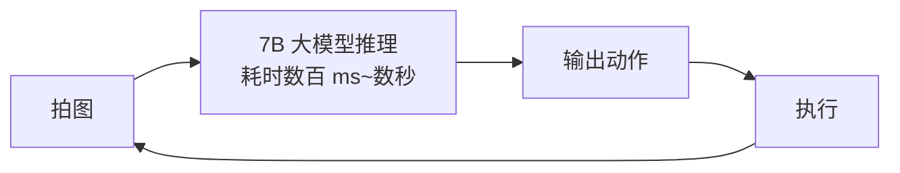
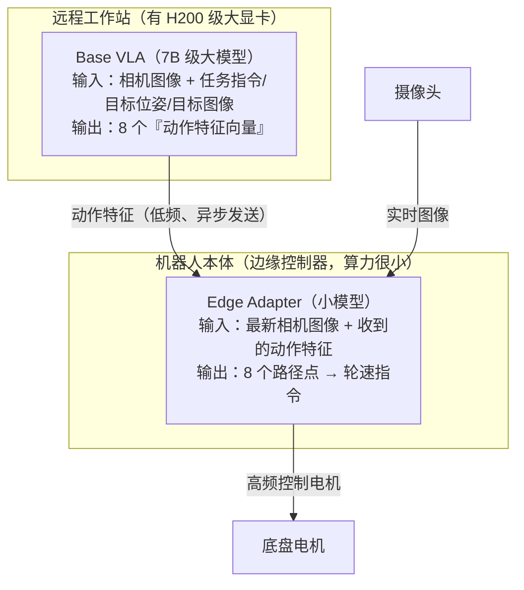

本文是「研究中心」系列的第一篇，面向**零基础读者**，完整拆解 UC Berkeley 团队的开源项目 **AsyncVLA**（An Asynchronous VLA for Fast and Robust Navigation on the Edge）。我们不假设你懂任何机器人学或深度学习知识，所有概念都会从头解释。文中所有技术细节均来自对官方开源代码（`NHirose/AsyncVLA`）的实际阅读，而非凭空推测。

<!-- more -->

## 1. 零基础前置知识包

在进入正题之前，先把这篇文章会用到的所有概念一次性讲清楚。如果你已经了解某些部分，可以跳过。

### 1.1 什么是具身智能（Embodied AI）

我们平时说的"AI"（比如 ChatGPT）活在文字世界里：输入文字，输出文字。**具身智能**指的是拥有**物理身体**的 AI——它有摄像头当眼睛、有轮子或机械臂当手脚，需要在真实的三维世界里感知环境、做出决策、完成移动或抓取等任务。

自动驾驶汽车、扫地机器人、波士顿动力的机器狗、仓库里的搬运机器人，都属于具身智能的范畴。

### 1.2 机器人的基本工作循环：感知 → 决策 → 执行

几乎所有机器人都运行着一个循环，叫做**感知-决策-执行循环（perception-decision-action loop）**：

1. **感知**：摄像头拍一张照片，传感器读一组数值（位置、朝向、速度等）；
2. **决策**：把照片和数值喂给某个"决策程序"，算出下一步该怎么做；
3. **执行**：把决策结果变成电机指令——"左轮转速 0.3m/s，右轮转速 0.25m/s"；
4. 回到第 1 步，周而复始。

这个循环每秒钟重复的次数叫做**控制频率**，单位是 Hz（赫兹，即"次/秒"）。控制频率越高，机器人对环境变化的反应越灵敏。人在走路时大脑的处理频率可以粗略理解为几十 Hz；而一个移动机器人在人群中穿行，通常也需要 10~30Hz 才显得"流畅"。

### 1.3 什么是 VLA（Vision-Language-Action 模型）

**VLA = Vision-Language-Action**，直译是"视觉-语言-动作"模型。它是最近两年机器人领域最火的方向，核心思想是：

> 把 GPT 那种"看图 + 识字 + 输出文字"的大模型，改造成"看图 + 识字 + **输出机器人动作**"。

一个典型的 VLA 模型内部有三块：

| 模块 | 作用 | 通俗比喻 |
|---|---|---|
| **视觉编码器**（Vision） | 把摄像头图像压缩成一串数字特征 | 视网膜 + 视觉神经 |
| **语言模型主干**（Language） | 理解任务指令、融合视觉信息、进行推理 | 大脑皮层 |
| **动作输出头**（Action） | 把内部推理结果转译成机器人能执行的动作 | 运动神经 |

VLA 的巨大优势在于**通用性**：传统机器人每换一个任务就要重新编程，而 VLA 像大语言模型一样"一个模型干所有活"——你用自然语言告诉它"走到蓝色的垃圾桶旁边"，它就能自己规划路线。

### 1.4 VLA 的致命弱点：又大又慢

能力强的 VLA 模型通常有 **7B（70 亿）级别的参数**——这和 Llama-2-7B 那一代语言模型是一个体量。这样的模型做一次"看图 → 想动作"的推理，在实验室的顶级显卡（如 H100）上也需要 **几百毫秒到几秒**，对应控制频率不到 1~5Hz。

这就是本文的**核心矛盾**：

> 大模型给了机器人"聪明的大脑"，但这个大脑的反应速度，远远跟不上机器人执行动作需要的节奏。更糟的是，机器人在户外跑动时，不可能背着一台 H100 服务器——机器人本体的计算设备（**边缘设备**，edge device）算力非常有限。

### 1.5 导航 vs 操作：机器人任务的两大类

| 任务类型 | 例子 | 动作形式 |
|---|---|---|
| **导航**（Navigation） | 移动机器人在园区/室内走到指定地点 | 底盘的线速度 + 转向角速度（二维平面运动） |
| **操作**（Manipulation） | 机械臂抓起杯子、叠衣服 | 每个关节的角度/力矩（多维空间运动） |

**AsyncVLA 解决的是导航问题**——让一个装有摄像头的轮式机器人，根据自然语言、目标图像或 GPS 坐标，在真实世界中又快又稳地到达目的地。

### 1.6 几个高频术语速查

| 术语 | 含义 | 通俗解释 |
|---|---|---|
| **Action chunk（动作块）** | 模型一次推理输出**连续多个时间步**的动作，而不是只输出一步 | 一次想好"未来 8 步怎么走"，而不是走一步想一步 |
| **Waypoint（路径点）** | 动作块里的每个动作，表示"相对当前位置前进多少" | 轨迹上一个个脚印 |
| **位姿（Pose）** | 位置 + 朝向，用 (x, y, θ) 表示 | 我在哪、脸朝哪 |
| **余弦/正弦编码角度** | 用 (cosθ, sinθ) 两个数代替角度 θ | 避免 359° 和 1° 在数值上"离得极远"的问题 |
| **LoRA** | 只训练插在原模型里的少量小矩阵，冻结原模型全部参数 | 不重写全书，只贴便签 |
| **ROS** | Robot Operating System，机器人操作系统，机器人界的"安卓" | 提供硬件通信、消息传递的标准框架 |
| **PD 控制器** | 一种经典的反馈控制算法，把"目标位置"换算成"轮子速度" | 把"想去哪"翻译成"轮子怎么转" |

## 2. AsyncVLA 是什么

**AsyncVLA**（arXiv: 2602.13476，MIT 协议开源）由 UC Berkeley 伯克利人工智能研究所（BAIR）的 Noriaki Hirose、Catherine Glossop、Sergey Levine 与普林斯顿大学的 Dhruv Shah 合作完成，作者同时来自丰田北美研究院（Toyota Motor North America）。这个团队是"视觉导航 + 机器人学习"方向的顶尖班底：Sergey Levine 是机器人深度学习的开创者之一，Dhruv Shah 是视觉导航模型 ViNT / GNM 系列的第一作者。

项目的目标一句话概括：

> **让 VLA 大模型驱动的导航机器人，能在算力弱小的机器人本体上做到"反应快、走得稳"。**

它的名字里有两个关键词：

- **Async（异步）**：大模型和小模型**不在同一个时钟上工作**——大模型慢悠悠地"深度思考"，小模型紧锣密鼓地"快速反应"，两者各干各的，互不阻塞；
- **Edge（边缘）**：专为机器人本体的低算力硬件设计，大模型可以放在远程工作站，机器人端只跑一个轻量模块。

## 3. 要解决的核心矛盾

先看传统做法为什么不行。如果直接在机器人上跑完整 VLA：



整条链路是**串行**的：机器人必须等大模型想完，才能动一步。后果有两个：

1. **反应慢**：控制频率被大模型推理速度锁死。机器人以 1m/s 走路时，如果 1 秒才决策一次，两次决策之间已经盲走 1 米——足以撞上突然出现的人或台阶；
2. **算不起**：机器人本体的边缘控制器（通常是一块嵌入式板子）根本装不下也跑不动 7B 模型。

AsyncVLA 的答案不是"把大模型压缩变小"，而是**架构层面的分工**——这和人类的工作方式惊人地相似：

> 人的大脑皮层负责"要去哪里"这种慢思考（路径级规划），而小脑和脊髓负责"迈腿时保持平衡"这种快反应（毫秒级控制）。没有人会等大脑想完全身再动。

## 4. 核心设计：Base VLA（大脑）+ Edge Adapter（小脑）

AsyncVLA 把整个系统拆成两部分，这也是代码仓库的名字由来——**Async + VLA**：



### 4.1 Base VLA：慢而聪明的大脑

Base VLA 基于 OpenVLA-OFT / OmniVLA 架构（代码沿用了 Prismatic 框架——OpenVLA 的官方训练代码库），内部是"视觉编码器 + Llama 系语言模型主干 + 动作回归头"的经典 VLA 组合。它的输入非常灵活，代码里定义了 **9 种模态组合**（`modality_id` 0~8），可以任意搭配：

- **卫星图**（satellite）：目标区域的高空俯视图；
- **位姿目标**（pose goal）：GPS 坐标 + 朝向；
- **图像目标**（image goal）："我要去照片里这个地方"；
- **自然语言**（language）："move toward blue trash bin"（朝蓝色垃圾桶走）。

推理时，用户给什么模态，就传对应的 `modality_id`，模型内部通过掩码机制决定"看哪些输入"——这是其前作 OmniVLA（全模态 VLA）留下的能力。

Base VLA 的输出**不是直接的动作**，而是 8 个**动作特征向量**（每个 1024 维，代码中由 `Proj_Actiontokens` 模块从语言模型隐状态压缩而来）。你可以把它理解为：

> 大脑输出的不是"迈左脚、迈右脚"这种具体指令，而是一份**抽象的行动意图书**——"接下来要往左前方绕过障碍走一段"。这份意图书需要有人翻译成具体的肌肉动作。

### 4.2 Edge Adapter：快而专注的小脑

翻译工作由 **Edge Adapter** 完成（代码中叫 `Edge_adapter`，变量名 affectionately 叫 `shead`，即 small head）。它非常小，结构是：

1. **两个 EfficientNet-B0 图像编码器**（一种轻量级卷积网络，手机上都能跑）：
   - 一个编码**当前帧**图像（3 通道）；
   - 一个编码**当前帧 + 上一帧堆叠**的图像（6 通道）——两帧叠在一起，网络就能看出"东西在往哪动"（光流的信息，但不需要显式计算光流）；
2. 一个**小型自注意力 Transformer 解码器**（4 层、4 头），把「8 个 VLA 动作特征 + 当前帧特征 + 帧对特征」共 10 个 token 放在一起做注意力融合；
3. 一个 4 层 MLP 输出 **8 个路径点增量**（每个 4 维：Δx、Δy、以及用 cos/sin 表示的朝向增量）；
4. `delta_to_pose` 把增量逐点累积成完整轨迹（纯张量运算，可微分），PD 控制器把第 4 个路径点换算成线速度和角速度指令，最后裁剪到安全范围（线速度 ≤0.5m/s、角速度 ≤1.0rad/s 等）发给电机。

**关键点：Edge Adapter 只接收 Base VLA 的特征作为"导航意图"，但用自己实时看到的最新图像来修正具体轨迹。** 这就是"快"的来源——它不依赖大模型的下一次输出。

### 4.3 异步机制：两层时钟各走各的

系统里有两个独立的时钟：

- **Base VLA 时钟**：每当机器人移动了一段距离（或每隔几秒），远程工作站用最新图像重新跑一次大模型，刷新一份"行动意图书"发给机器人；
- **Edge Adapter 时钟**：机器人本体以高控制频率（实际部署为 ROS1 控制循环）持续运行，每一步都拿着「最新收到的意图书 + 最新拍到的图像」重新预测一遍 8 个路径点。

两个时钟**不需要互相等待**：

- 大模型推理的那几百毫秒到几秒里，机器人照常走路（用的是上一份意图 + 新图像），不会"卡住"；
- 就算网络抖动、大模型暂时失联，Edge Adapter 仍能靠旧意图和新图像维持一段时间的合理行为——这就是论文标题里 **Robust（鲁棒）** 的含义。

官方示例代码 `inference/run_asyncvla.py` 里有一段非常直观的演示：固定同一份 VLA 特征，分别用「过去帧」和「当前帧」作为 Edge Adapter 的输入跑两次，画出两条轨迹——你会看到**仅凭新图像，轨迹就已经明显更新了**，证明小模型在实时"看着路走路"，而不是傻等大脑。

## 5. 代码库导览：每个目录在干什么

```
AsyncVLA/
├── prismatic/                  # 模型主体（源自 OpenVLA 的 Prismatic 框架）
│   ├── models/
│   │   ├── backbones/          # 视觉编码器（SigLIP/DINO 等）与语言主干（LLaMa2）
│   │   ├── action_heads.py     # 动作回归头（L1 回归）
│   │   ├── projectors.py       # 把目标位姿投影进语言空间的 ProprioProjector
│   │   ├── small_head.py       # ★ Edge Adapter + Proj_Actiontokens（本文核心创新所在）
│   │   └── vlas/ vlms/         # VLA / VLM 模型组装
│   ├── extern/hf/              # HuggingFace 格式的模型定义（推理时用 AutoModel 加载）
│   ├── vla/
│   │   ├── constants.py        # 关键常数：动作块长度 8、动作维度 4、位姿维度 4
│   │   ├── action_tokenizer.py # 把连续动作离散化成 token（供语言模型"说"出动作）
│   │   └── datasets/           # 各数据集的 Dataset 类（GNM/LeLaN/SACSoN/Frodobots…）
│   └── training/               # 训练工具（掩码构造等）
├── vla-scripts/
│   └── train_asyncvla.py       # ★ 训练主脚本（一 thousand 多行，含两阶段训练开关）
├── inference/
│   └── run_asyncvla.py         # ★ 推理示例（含轨迹可视化）
├── config_nav/
│   ├── dataset_config.yaml     # 数据集路径与 Edge Adapter 结构参数
│   └── mbra_config.yaml        # 前作 MBRA 的结构参数
├── experiments/                # 真机部署的辅助工具
└── SETUP.md                    # 环境安装说明
```

几个值得展开的点：

**`constants.py` 的数字从哪来？** `NUM_ACTIONS_CHUNK=8` 表示一次预测未来 8 个路径点；配置里 `metric_waypoint_spacing=0.1` 表示相邻路径点间隔 0.1 米——即模型每次规划**未来 0.8 米**的轨迹。`ACTION_DIM=4` 的四个分量是 (Δx, Δy, cosΔθ, sinΔθ)。

**动作既用 token 又用回归？** 这是 OpenVLA-OFT 的思路：训练时语言模型照样对动作 token 做下一词预测（保持语言主干的能力），但真正的动作值由并行的回归头从隐状态直接算出（更精确、支持连续控制）。AsyncVLA 在此之上多加了一层 `Proj_Actiontokens`——把"给回归头用的隐状态"再压缩成 Edge Adapter 能吃的 1024 维特征。

**推理示例怎么用？** 把自己的两张照片命名成 `past.png` / `cur.png`、一张目标图命名成 `goal.png` 放进 `inference/`，设置起点终点 GPS，运行后生成 `visualization_asyncvla.jpg`——左边是输入图像，右边是预测的二维轨迹图（蓝色为旧图像、红色为新图像的预测），并标注本次使用的模态（如 "pose and image"）。

## 6. 数据与训练

### 6.1 用了哪些数据集

| 数据集 | 内容 | 规模特点 |
|---|---|---|
| **GNM** | 户外/园区导航（recon、go_stanford、cory_hall、tartan_drive、seattle、scand 等子集） | ViNT 系列的标准数据 |
| **LeLaN** | 带自然语言指令的导航（作者前作提出） | 图像 + 语言 + 位姿 |
| **SACSoN (HuRoN)** | 人体环境中的人类居住空间导航 | 有人走动的真实场景 |
| **Frodobots** | 众包遥控小车在全球各地实跑的数据（通过 HuggingFace LeRobot 加载） | 真实世界长尾场景 |

训练时用**加权随机采样**把多个数据集混在一起（每个 batch 从不同数据集按权重抽取），这是机器人多数据集联合训练的标准做法。

### 6.2 两阶段训练

`train_asyncvla.py` 开头有两个总开关：

```python
TRAIN_BASE = False   # 训练 Base VLA（需要 H100/H200 级显卡）
TRAIN_HEAD = True    # 训练 Edge Adapter 和动作特征投影器
```

- **阶段一（TRAIN_BASE）**：用 LoRA（rank 128）微调 Base VLA 本体。官方配置用了 **5 张 H200（每张 140GB 显存）**，每个数据集 batch size 6，梯度累积 2 步——这告诉你复现完整训练的门槛很高；
- **阶段二（TRAIN_HEAD）**：冻结 Base VLA，只训练 Edge Adapter 和 `Proj_Actiontokens`。这一阶段轻量得多，也是普通研究者最值得复现的部分。

训练脚本中还能看到 `robot_pos_model`（根据速度积分推算机器人未来位置）、`twist_to_pose_diff_torch`（速度→位姿换算）等工具函数——训练时模型需要"想象"执行动作块后机器人会在哪，以便构造一致的监督信号。

### 6.3 硬件与环境

- Python 3.10 + PyTorch 2.2 + Flash-Attention 2.5.5；
- 预训练权重发布在 HuggingFace：`NHirose/AsyncVLA_release`（含 Base VLA、action head、投影器和 Edge Adapter 的全部 checkpoint，恢复步数 750000）；
- 真机部署：Base VLA 跑在远程工作站，Edge Adapter 跑在机器人的边缘控制器上，通过 **ROS1** 通信（论文附录有细节）。

## 7. 宏观架构分析：这个系统是如何"组装"起来的

看完单个零件，退后一步看整台机器。宏观层面值得分析的有四件事：数据流拓扑、代码血统、关键设计权衡、以及"异步"这个词在代码里到底落在哪里。

### 7.1 数据流全景：一次控制决策要经过几层

从摄像头到电机，一次完整的控制决策要穿过下面这条流水线。注意**每一级所在的物理位置和运行频率都不同**——这是理解整个系统的钥匙：

```
【远程工作站，~0.1~0.3 Hz】
  图像+目标 → OpenVLA 前向（7B）
      → 取出动作 token 位置的隐状态 (B, 8×4, 4096)
      → Proj_Actiontokens 压缩成 (B, 8, 1024)「意图书」
      → 经网络发给机器人
                          ↓
【机器人边缘控制器，~3 Hz 控制循环】
  收到意图书（旧） + 当前帧/上一帧图像（新，96×96）
      → 双 EfficientNet-B0 编码 → 10 token 注意力融合
      → MLP 输出 (8, 4) 增量 → delta_to_pose 累积成轨迹
      → 取第 4 个路径点 → PD 控制器 → 限速裁剪
      → (v, ω) 速度指令 → ROS → 底盘电机
```

注意一个容易忽略的细节：推理示例 `run_asyncvla.py` 里 `self.tick_rate = 3`——**Edge Adapter 侧的控制频率也只有 3Hz**，它每 0.33 秒才重新预测一次 8 个路径点（覆盖未来 0.8 米）。所以"快"的真正含义不是Edge Adapter 跑了几十 Hz，而是**机器人的决策节奏不再被大模型的秒级延迟绑架**：3Hz 的规划对 0.5m/s 的步行机器人来说已经足够精细（每步之间只盲走 ~17cm）。

### 7.2 代码血统：一个仓库里的三条技术脉络

看依赖就能看出这个项目的"出身"：

| 依赖 | 来源 | 在仓库中的角色 |
|---|---|---|
| `prismatic/` | OpenVLA-OFT（Stanford/Berkeley） | Base VLA 的全部基础设施：模型、训练、数据集框架。AsyncVLA 直接 **fork 整个框架**再改，而不是作为库引用 |
| `vint_train` | GNM/NoMaD/ViNT（作者团队前作） | 只用到了 `MultiLayerDecoder_trans` 等几个类——**Edge Adapter 的骨架就是从这来的** |
| `lerobot` | HuggingFace | 只用于加载 Frodobots 数据集 |

fork 而非引用是研究代码的常见策略：OpenVLA-OFT 的训练循环、掩码构造、数据集协议都要为"9 模态 + 特征投影"做侵入式修改，包一层库接口反而更绕。代价就是文章前面提到的工程整合度问题——`inference/run_asyncvla.py` 开头要手动 `sys.path` 拼接两个外部仓库路径，`shead`（小脑）、`action_proj` 等模块甚至以全局变量的形式在函数间传递。**这不是干净的软件工程，但对"快速验证一个研究想法"来说是最短路径**——读这类仓库时要习惯这种"论文优先、工程靠后"的风格。

### 7.3 五个关键设计决策及其权衡

| 决策 | 为什么这么做 | 付出的代价 |
|---|---|---|
| **传 1024 维特征，而不是传 8 个路径点** | 特征保留了"往哪绕、朝哪看"的语义，Edge Adapter 能结合新图像**重新规划**整条轨迹；如果只传最终动作，小脑就退化成轨迹跟踪器，失去鲁棒性 | Base VLA 和 Edge Adapter 必须**联合训练**（特征的语义是小脑定义的），两阶段不能完全解耦 |
| **小脑自己看图，而不只听指挥** | 意图书可以过期 1~2 秒，但实时图像永远新鲜——避障反应完全由小脑的视觉通路承担 | 小脑需要两个 EfficientNet + 96×96 图像预处理，边缘端也要有推理能力 |
| **回归头而非扩散头**（`use_diffusion=False` 但代码保留了完整接口） | 导航轨迹是低维（8×4）连续量，L1/MSE 回归一次前向即可，不需要扩散的多步去噪——为边缘部署省时 | 多模态歧义场景（往左绕还是往右绕都行）下回归会输出"取平均"的折中轨迹 |
| **cos/sin 编码角度** | θ=359° 和 θ=1° 数值上离得极远，回归损失会在 0° 附近被撕扯；(cos,sin) 把角度映射到单位圆上无断裂 | 动作维度从 3 变 4，且要用 `atan2` 还原（`delta_to_pose` 里的细节） |
| **modality_id 随机采样**（数据集代码里 `random.choice(modality_list)`） | 训练时随机丢弃某些模态，推理时"手里有什么用什么"，抗传感器失效 | 单个样本监督信号变弱（比如 pose-only 时语言能力没被训练） |

### 7.4 "异步"到底落在哪里？——两种实现的对照

读完代码会发现一个微妙的事实：**AsyncVLA 仓库里没有任何"异步调度"代码**。没有线程、没有队列、没有时钟同步逻辑。所谓异步，是**部署拓扑**赋予的：

- Base VLA 是远程工作站上的一个**独立服务**，触发时机（走了一段距离/每隔几秒）由真机端的 ROS 节点决定；
- Edge Adapter 在机器人本地循环里同步运行；
- 两者的"消息总线"是网络 + ROS1 topic，唯一的同步契约是那份 1024×8 的特征张量的形状。

也就是说，AsyncVLA 的"异步"是**空间上的**（两个时钟物理分离，靠消息传递解耦），VLASH 的"异步"是**时间上的**（单进程单卡，靠"预测未来状态"填补信息差）。这个对照在代码层面非常清楚：AsyncVLA 的鲁棒性来自"消息可以迟到，但不阻塞小脑"；VLASH 的鲁棒性来自"观察可以过期，但模型学过怎么处理过期"。前者需要额外硬件链路，后者需要额外训练技巧——两条路线的复杂度花在了不同的地方。

### 7.5 失败模式分析（代码里能看到的那部分）

- **特征陈旧**：大模型 3 秒没刷新意图书时，小脑仍会按旧意图+新图像走路。走直线没问题，但"该转弯了"这种意图级变化会延迟 3 秒——训练数据里 `GNM_Dataset_rand` 的随机延迟增强（见 9.7 节）就是在模拟这种情况；
- **网络断连**：小脑持续执行旧意图，机器人不会停——这对导航任务是合理的降级（比急停更安全），但代码里没有看到"特征超时保护"逻辑，真机部署需要自己加；
- **模态输入全丢**：modality 掩码允许全部输入关掉吗？看代码不行——自视角图像的掩码硬编码为 `True`（9.1 节），摄像头失效时系统没有定义行为。

## 8. 上手路径（不买机器人也能玩）

1. 按 `SETUP.md` 建 conda 环境；
2. `git clone https://huggingface.co/NHirose/AsyncVLA_release`（还需要一并克隆前作仓库 `Learning-to-Drive-Anywhere-with-MBRA` 提供模型定义）；
3. 准备 `past.png / cur.png / goal.png` 三张图，运行 `python inference/run_asyncvla.py`；
4. 打开 `visualization_asyncvla.jpg` 查看生成的轨迹与模态标注。

整个过程不需要真机、不需要多卡，一张消费级显卡即可体验完整推理流程。

## 9. 关键代码精读：核心源码走读

这一节我们直接把仓库里最关键的几段代码摊开讲——每段代码后面跟着"为什么这么设计"。所有摘录均来自 `NHirose/AsyncVLA` 仓库实际源码（有删减，删减处用 `...` 标出）。

### 9.1 模态掩码：9 种输入组合是怎么"关掉"一部分输入的

位置：`prismatic/extern/hf/modeling_prismatic.py` 的 `_build_multimodal_attention_MMN`。

推理时调用方只传一个整数 `modality_id`（0~8），模型内部把它翻译成四个布尔开关（语言 / 自视角图像 / 位姿 / 卫星图），再变成注意力掩码：

```python
for ib in range(projected_patch_embeddings.shape[0]):
    if modality_id[ib] == 0: # satellite image only
        modality_lan = False; modality_img = False
        modality_pose = False; modality_sate = True
    elif modality_id[ib] == 4: # pose only
        modality_lan = False; modality_img = False
        modality_pose = True;  modality_sate = False
    elif modality_id[ib] == 8: # language + pose
        modality_lan = True;   modality_img = False
        modality_pose = True;  modality_sate = False
    # ... 其余 6 种组合同理

    obimg_attention_mask  = torch.full((1, 256), fill_value=True,          ...)  # 自视角图像 256 个 patch：永远可见
    img_attention_mask    = torch.full((1, 256), fill_value=modality_img,  ...)  # 目标图像 256 个 patch
    sate_attention_mask   = torch.full((1, 512), fill_value=modality_sate, ...)  # 卫星图 512 个 patch
    pose_attention_mask   = torch.full((1, 1),   fill_value=modality_pose, ...)  # 目标位姿 1 个 token
```

**设计要点**：

1. **不删 token，只关注意力**。无论选哪种模态，卫星图的 512 个 patch token 都在序列里，只是被掩码挡住——序列长度恒定，显存占用可预测，也不需要为每种模态写一套前向逻辑；
2. **自视角图像永远可见**（`fill_value=True`）——不管任务是"去 GPS 坐标 X"还是"去蓝色垃圾桶"，机器人当前看到的路都是必需输入；
3. **每个样本独立选择模态**（循环里按 `ib` 逐样本构造掩码），所以一个 batch 里可以同时混着"卫星图样本"和"语言样本"训练——这正是它能吃下 GNM/LeLaN/SACSoN 等异构数据集的原因。

### 9.2 Edge Adapter 前向：10 个 token 的小脑（`prismatic/models/small_head.py`）

这是全文最核心的一个类，完整前向只有十几行：

```python
class Edge_adapter(nn.Module):
    def __init__(self, obs_encoding_size=512, mha_num_attention_heads=2,
                 mha_num_attention_layers=2, mha_ff_dim_factor=4):
        self.cat_encoder = EfficientNet.from_name("efficientnet-b0", in_channels=6)  # 编码「当前帧+上一帧」堆叠图
        self.obs_encoder = EfficientNet.from_name("efficientnet-b0", in_channels=3)  # 只编码当前帧
        ...
        self.decoder = MultiLayerDecoder_trans(
            embed_dim=self.obs_encoding_size,
            seq_len=8+1+1,                       # 8 个 VLA 动作特征 + 当前帧 + 帧对 = 10 个 token
            output_layers=[256, 128, 64, 32],
            ...
        )
        self.action_predictor = nn.Sequential(   # 4 层 MLP：512 → 256 → 128 → 64 → 8×4
            nn.Linear(self.obs_encoding_size, 256), nn.ReLU(),
            nn.Linear(256, 128), nn.ReLU(),
            nn.Linear(128, 64),  nn.ReLU(),
            nn.Linear(64, 8 * 4),
        )

    def forward(self, obs_img, past_img, vla_feature):
        cat_img = torch.cat((obs_img, past_img), dim=1)      # 3+3=6 通道
        cat_encoding = self.cat_encoder(...)
        obs_encoding = self.obs_encoder(...)
        tokens = torch.cat((vla_feature, obs_encoding.unsqueeze(1),
                            cat_encoding.unsqueeze(1)), dim=1)   # (B, 10, 512)
        tokens = self.decoder(tokens)[:, -2:-1, :]           # ★ 只取「当前帧」位置的输出 token
        action_pred = self.action_predictor(tokens.reshape(tokens.shape[0], -1))
        return action_pred.reshape(batch_size, NUM_ACTIONS_CHUNK, -1)  # (B, 8, 4)
```

**值得咀嚼的三个设计细节**：

1. **`[:, -2:-1, :]`——只取当前帧位置的那个输出 token**。10 个 token 做完自注意力后，每个位置都融合了全部上下文，作者只读"当前帧"这个位置的输出作为轨迹依据。这与 ViNT/NoMaD 的做法一脉相承——实际上 `MultiLayerDecoder_trans` 直接 import 自 `vint_train.models.vint.self_attention`，也就是说**小脑的骨架就是作者团队此前 GNM/NoMaD 导航模型的原班结构**，只是把原来"目标图像 token"的位置换成了"VLA 动作特征"。这是"站在前作肩膀上做增量"的教科书案例；
2. **双帧信息是"免费的"**。没有光流计算、没有时序模型，就是把两帧 RGB 拼成 6 通道塞进同一个 EfficientNet——网络自己学会从像素差里读出运动趋势。卷积网络对通道间差异的敏感性是现成的先验；
3. **实际超参比默认值大一号**。上面 `__init__` 里的默认值是 2 层 2 头，真实部署读的是 `config_nav/dataset_config.yaml`：`obs_encoding_size: 1024`、`mha_num_attention_heads: 4`、`mha_num_attention_layers: 4`，输入图像 96×96。即便如此它也只有百万级参数——对比 Base VLA 的 70 亿，比例约 1:10000。

### 9.3 Proj_Actiontokens：从"隐状态"到"意图书"的压缩器

同样在 `small_head.py`，它把 Base VLA 输出的动作隐状态压成 Edge Adapter 能吃的 1024 维特征：

```python
class Proj_Actiontokens(nn.Module):
    def __init__(self, input_dim=4096, hidden_dim=4096, action_dim=7):
        self.model = MLPResNet_idcat(
            num_blocks=2,
            input_dim=input_dim * ACTION_DIM,   # 每个路径点：4096 维隐状态 × 4 个动作分量
            hidden_dim=hidden_dim,
            output_dim=action_dim,              # 这里被实例化成 1024
        )

    def predict_action(self, actions_hidden_states, taskid):
        # (B, 8*4, 4096) -> (B, 8, 4096*4)
        rearranged = actions_hidden_states.reshape(batch_size, NUM_ACTIONS_CHUNK, -1)
        action = self.model(rearranged, taskid)  # (B, 8, 1024)
        return action
```

`MLPResNet_idcat` 的后缀 `idcat` 意为 **id + concat**：每个路径点的特征在进 MLP 前会拼接一个标量 `taskid`（数据集编号）：

```python
def forward(self, x, taskid):
    x = torch.cat((x, taskid.unsqueeze(1).unsqueeze(2).repeat(1,8,1)), axis=2)
    ...
```

这个不起眼的小设计解决的是多数据集联合训练的老问题：不同数据集的动作分布差异很大（园区小车 vs 室内人为环境），用一个标量告诉投影器"这批特征来自哪个数据集"，同一个网络就能对不同来源做不同的"口音转换"。

### 9.4 delta_to_pose：可微的轨迹积分器（`inference/run_asyncvla.py`）

Edge Adapter 输出的是**增量** (Δx, Δy, cosΔθ, sinΔθ)，要累积成完整轨迹才能用：

```python
def delta_to_pose(delta):
    dx, dy = delta[..., 0], delta[..., 1]
    dtheta = torch.atan2(delta[..., 3], delta[..., 2])   # cos/sin -> 角度
    poses = []
    x, y, theta = dx[:, 0], dy[:, 0], dtheta[:, 0]
    poses.append(torch.stack([x, y, torch.cos(theta), torch.sin(theta)], dim=-1))
    for t in range(1, T):
        ct, st = torch.cos(theta), torch.sin(theta)
        dx_w = ct * dx[:, t] - st * dy[:, t]    # 把机器人坐标系的增量旋转到世界坐标系
        dy_w = st * dx[:, t] + ct * dy[:, t]
        x = x + dx_w; y = y + dy_w; theta = theta + dtheta[:, t]
        poses.append(torch.stack([x, y, torch.cos(theta), torch.sin(theta)], dim=-1))
    return torch.stack(poses, dim=1)
```

两个细节：注释专门强调 *Fully differentiable, no inplace ops*（不用原地操作）——因为训练时这条链路也在计算图里（平滑损失要过它）；每一步的增量都要乘上**当前朝向的旋转矩阵**，因为模型输出的是"机器人脚下的步子"，而轨迹图需要"世界坐标系的脚印"。

### 9.5 PD 控制器与限速（`inference/run_asyncvla.py`）

8 个路径点（间隔 0.1m，共 0.8m）最终只用一个换算成速度：

```python
def pd_controller(self, actions, metric_waypoint_spacing):
    waypoint_select = 4                              # 选第 4 个路径点 ≈ 0.4m 处
    chosen_waypoint = waypoints[0][waypoint_select].copy()
    chosen_waypoint[:2] *= metric_waypoint_spacing   # 归一化单位还原成米
    dx, dy, hx, hy = chosen_waypoint
    ...
    linear_vel_value  = np.clip(linear_vel_value, 0, 0.5)    # 线速度 ≤ 0.5 m/s
    angular_vel_value = np.clip(angular_vel_value, -1.0, 1.0) # 角速度 ≤ 1.0 rad/s
    # 再做一次曲率一致性限速：转弯太快时同步压低线速度（maxv=0.3, maxw=0.3）
```

选中间点而不是终点是导航领域的经典折中：第 0 点太近（噪声敏感），第 7 点太远（与当前意图偏差大），第 4 点（0.4m 处）兼顾了响应速度和方向准确性。

### 9.6 训练侧：复合损失与"全网 Linear 都挂 LoRA"

`vla-scripts/train_asyncvla.py` 里 Edge Adapter 的损失是四项 MSE 的加权和：

```python
loss = 0.5*MSELoss()(action_ref[~lan_bool],  predicted_actions[~lan_bool]) \
     + 0.5*15.0*MSELoss()(daction_ref[~lan_bool], predicted_dactions[~lan_bool]) \
     + 0.1*MSELoss()(obj_pose_norm[lan_bool], predicted_actions[:,-1,0:2][lan_bool]) \
     + 0.1*MSELoss()(sm_ref, predicted_actions)
```

逐项拆开看：

| 项 | 权重 | 监督什么 | 为什么 |
|---|---|---|---|
| 轨迹位姿 MSE | 0.5 | 累积后的完整轨迹 | 最终评价指标 |
| **增量 MSE（×15）** | 7.5 | 单步增量 Δ | 增量数值小，放大 15 倍才能和位姿项抗衡——直接监督每一步"脚该怎么迈" |
| 物体位置 MSE | 0.1 | 仅语言任务（`lan_bool`），轨迹终点的 (x,y) | "走向蓝色垃圾桶"的终点应落在物体附近 |
| 平滑项 | 0.1 | `sm_ref`（上一步预测位姿拼接当前轨迹） vs 全轨迹 | 惩罚相邻路径点的跳变，让轨迹顺滑 |

掩码 `~lan_bool` / `lan_bool` 的写法也值得注意：不同损失只对对应来源的样本生效——位姿/图像/卫星任务不监督"物体位置"，语言任务不参与另外三项，各项之间互不干扰。

LoRA 的配置则简单粗暴：

```python
target_modules = []
for name, module in vla.named_modules():
    if isinstance(module, torch.nn.Linear):
        target_modules.append(name)          # 所有 Linear 层全部挂 LoRA

lora_config = LoraConfig(r=cfg.lora_rank,          # 128
                         lora_alpha=min(cfg.lora_rank, 16),  # 固定上限 16
                         target_modules=target_modules, ...)
```

不挑模块、全网挂载，rank=128 相当大——说明 Base VLA 阶段是"大刀阔斧改造"而非轻微适配（要把纯视觉语言模型改造成会看卫星图、会输出 8 步轨迹的导航器）。配合 `TRAIN_BASE=False` 时对 VLA 前向包一层 `torch.no_grad()`，同一个脚本里两个阶段共用一套数据管线，只是梯度流向不同。

### 9.7 数据管线的微观解剖：`gnm_dataset.py` 里的四个心机

宏观架构的很多理念，其实藏在数据集代码的细节里。以 `prismatic/vla/datasets/gnm_dataset.py` 为例：

**（1）LMDB 图像缓存——为多 worker 服务的读优化**：

```python
def _build_caches(self, use_tqdm=True):
    cache_filename = os.path.join(self.data_split_folder, f"dataset_{self.dataset_name}.lmdb")
    ...
    if not os.path.exists(cache_filename):
        with lmdb.open(cache_filename, map_size=2**40) as image_cache:   # 1TB 上限
            ...  # 把所有图像一次性打包进单个 LMDB 文件

def _get_image_cache(self):
    if self._image_cache is None:       # 惰性打开，每个 DataLoader worker 各自一个只读 env
        self._image_cache = lmdb.open(self._image_cache_path, readonly=True,
                                      lock=False, readahead=False, max_readers=2048)
    return self._image_cache
```

导航数据集动辄几十万张小图散落在文件系统里，随机读的寻址开销是训练瓶颈。打包成单个 LMDB 后顺序读盘；`lock=False` + worker 本地 env 让 10 个 dataloader worker（`num_workers: 10`）无锁并发读。注释 `# DO NOT open the env here — only store the path` 是踩过坑的痕迹：LMDB env 不能随对象 pickle 跨进程，必须在 worker 里惰性重建。

**（2）随机水平翻转 + 符号联动**——数据增强最容易出错的地方：

```python
else:   # 50% 概率翻转
    cur_image_large = torch.flip(cur_image_large, [2])
    obs_image = torch.flip(obs_image, [2])
    goal_image = torch.flip(goal_image, [2])
    actions[:, 1] = -actions[:, 1]        # y 增量取反
    actions[:, 3] = -actions[:, 3]        # sin(Δθ) 取反
    goal_pose_cos_sin[1] = -goal_pose_cos_sin[1]
    goal_pose_cos_sin[3] = -goal_pose_cos_sin[3]
```

图像左右翻转后，所有 y 分量和角度正弦分量必须同步取反，x 和 cos 不动——一处忘了改，模型就会学到"镜像世界"的错误物理。五个张量逐一联动的代码就是这类 bug 的防线。

**（3）按距离动态收窄模态分布**：

```python
modality_list = [4, 5, 6]                 # pose only / pose+image / image only
if distance <= 20:
    modality_id = random.choice(modality_list)
else:
    modality_id = random.choice(modality_list[0:2])   # 距离太远 → 不允许 image-only
```

目标在 2 米开外（20×0.1m），一张目标图像在 224×224 像素里已经看不清任何东西——此时强行让模型用 image-only 模态只会污染训练。数据集按物理常识约束了模态采样空间，这种"先验写进采样器"的手法比在网络里加约束便宜得多。

**（4）`GNM_Dataset_rand` 的"随机延迟"增强——宏观异步理念的微观对应**。这是整个数据集里最值得细读的一段（在 `__getitem__` 里，伪码整理）：

```python
lt = random.randint(0, 9)                          # 80% 概率：小延迟 0~9 步
obs_lt = self._load_image(f_curr, curr_time - lt)  # 当前帧改成「lt 步之前」的过期图像
...
if random.random() > 0.2:
    lt = random.randint(10, 30)                    # 20%×80% 概率：大延迟 10~30 步
    obs_lt = self._load_image(f_curr, curr_time - lt)

goal_image = self._load_image(f_goal, goal_time - lt)   # 目标图同步回退
_, goal_pos, goal_yaw = self._compute_actions(..., curr_time-lt, goal_time-lt)

dist = np.sqrt((actions[7,0]-actions_lt[7,0])**2 + ...)  # 新旧起点的轨迹末点距离
if rand_dist > 0.5 and dist > 4.0:                       # 50% 样本要求轨迹差异够大
    flag_dist = False                                     # 否则重新采样
```

它模拟的正是部署时的情形：Edge Adapter 收到的"当前帧"其实是大模型上次推理之后拍的（图像比动作特征新），或者反过来图像因相机延迟过期了 0~3 秒。模型被迫学会"无论图像和意图差几个时间步，都能对齐"。而 `dist > 4.0` 的过滤保证采到的是"过期图像真的会改变决策"的难样本——延迟为 0 和延迟为 30 步的轨迹几乎一样的样本没有训练价值。**这一段代码就是论文里"异步鲁棒性"声明的实验落地处**。

### 9.8 异构数据的统一接口

AsyncVLA 一共有 6 个数据集类（`gnm_dataset.py`、`lelan_dataset.py`、`sacson_dataset.py`、`frodobots_dataset.py` 等），但它们都输出**同一张字典契约**：

```python
return dict(
    pixel_values=...,          # 自视角图像（224×224，经 OpenVLA image_transform）
    pixel_values_goal=...,     # 目标图像
    input_ids=..., labels=..., # OpenVLA chat 格式的 token 序列，labels 只在动作 token 上
    modality_id=...,           # 本次样本的模态（0~8，见 9.1 节）
    actions=...,               # (8, 4) 归一化动作块
    goal_pose=...,             # (x, y, cosθ, sinθ) 归一化目标位姿
    obj_pose_norm=...,         # 语言任务的物体位置（语言数据集才有，其余 dummy）
    c_image=..., p_image=...,  # 96×96 当前帧/堆叠帧 → 给 Edge Adapter
    ...
)
```

无论上游数据是 GPS 轨迹（GNM）、语言标注（LeLaN）还是众包遥控车（Frodobots），进了训练循环都长一个样。这是"fork 整个框架"换来的能力：`train_asyncvla.py` 只需面对一种 batch 格式。其中 `labels[:-(action_chunk_len+1)] = IGNORE_INDEX` 这行（每个数据集类里都有）是 OpenVLA 系的标准操作——语言模型的下一词预测损失只在动作 token 上生效，图像 token 和 prompt 全部屏蔽。

### 9.9 一个"研究代码"的典型样貌

最后坦率指出几处读码时要注意的"毛边"，它们本身就是有信息量的：

- `run_asyncvla.py` 里有成片的注释掉的实验代码（`data_transformer_asyncvla` 的旧签名、`goal_pose_loc_norm` 的两种写法），说明推理接口还在迭代中；
- `gnm_dataset__.py`（注意双下划线）是 `gnm_dataset.py` 的旧版本，被留在仓库里没有删；
- 推理示例里 GPS、罗盘角全部硬编码为伯克利校园的坐标，`modality_id` 的选择逻辑在 `__main__` 里用布尔变量手工拼；
- `Edge_adapter_v0`、`MLPResNet_idcat` 等多个历史版本共存于 `small_head.py`。

这些毛边不影响复现（按 README 的路径走是通的），但提醒读者：**这份代码的定位是论文的证据链，不是可维护的库**。想在它之上做开发，第一件事应该是把模态选择、输入管线抽成配置，而不是直接在示例脚本上改。

## 10. 技术亮点总结

1. **架构级异步解耦**：不是靠模型压缩或量化硬怼延迟，而是"意图与执行分离"——大模型低频给意图，小模型高频做执行。这个思路对任何"大模型控制物理设备"的场景都有借鉴意义；
2. **9 种模态自由组合**（继承自 OmniVLA）：卫星图 / 位姿 / 图像目标 / 语言任意搭配，实际部署中哪种子可用就用哪种，显著提升鲁棒性；
3. **Edge Adapter 的双帧设计**：当前帧 + 前一帧堆叠编码，让小模型获得动态信息，这是它"看着路走路"的关键；
4. **训练是分层的**：贵的 Base VLA 训练一次，便宜的 Edge Adapter 可以频繁迭代——工程上非常务实；
5. **完整的真机部署路径**：从 GPS 目标、PD 控制到 ROS1 分离部署，代码里是"能直接抄"的工程细节，而不只是论文示意图。

## 11. 局限与思考

- **导航专属**：动作空间是二维平面运动（Δx、Δy、Δθ），不能直接用于机械臂操作。操作类任务请看本系列第二篇 VLASH；
- **依赖前作仓库**：完整运行需要再克隆 `Learning-to-Drive-Anywhere-with-MBRA` 和 `lerobot` 并手动拼路径，工程整合度一般；
- **完整训练门槛高**：Base VLA 阶段需要 5×H200，个人复现基本只能停留在 TRAIN_HEAD 阶段；
- **示例代码有"演示痕迹"**：部分输入被硬编码（如固定的起点 GPS），真机使用需按注释自行接入传感器。

尽管如此，AsyncVLA 给"具身智能如何落地到弱算力设备"提供了一个教科书级的范式：**大脑与小脑分离、时钟异步、意图与执行解耦**。这套思路和第二篇要讲的 VLASH 形成了有趣的对照——后者在单机上用纯软件调度达到了类似效果。

## 12. 延伸阅读

- 论文：[arXiv:2602.13476](https://arxiv.org/abs/2602.13476) ｜ [项目主页](https://asyncvla.github.io)
- 前置论文：OpenVLA-OFT、OmniVLA（多模态 VLA）、ViNT / GNM（视觉导航基础模型）、LeLaN（语言导航数据集）
- 配套阅读：本系列第二篇 [VLASH 深度解析](./vlash-explained.md)
